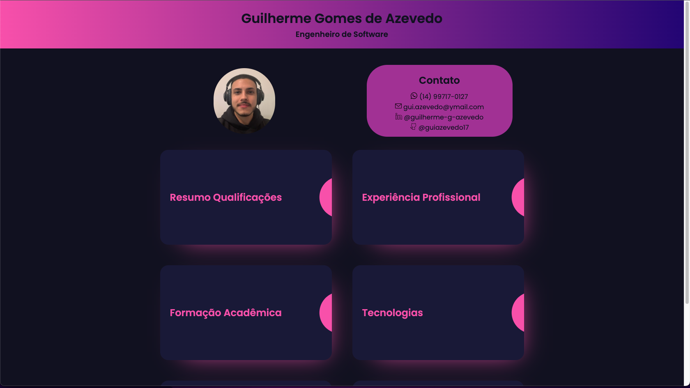
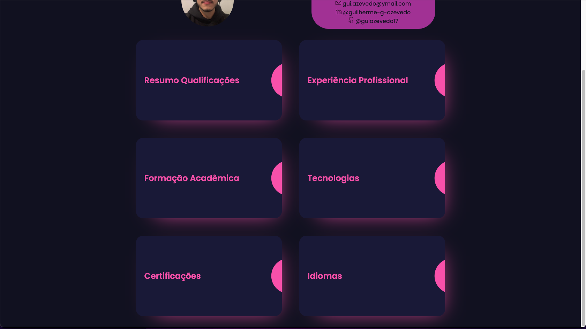
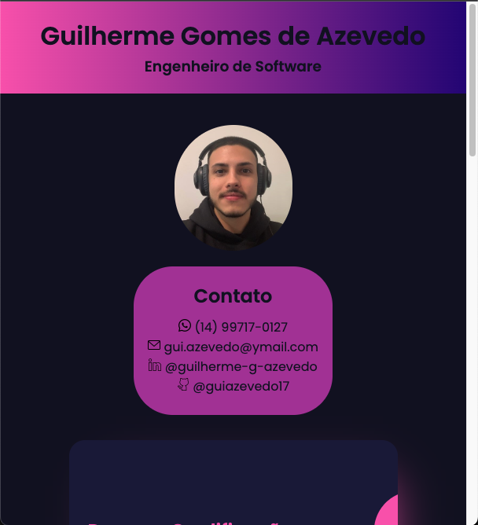
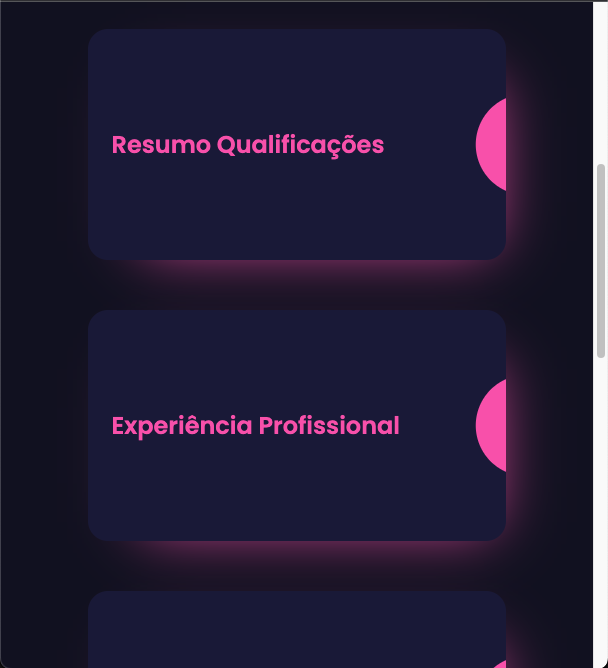

# Descrição
Projeto incentivado pela universidade utilizando apenas HTML e CSS. Através desse incentivo e após um certo entusiasmo pela área de front-end o projeto se desenvolveu além do esperado, superando toda ideia inicial agregando um conhecimento âmplo das respectivas linguagens. 
Os quesitos mais desenvolvidos ao longo do projeto foram as propriedades de display, tanto flex quanto grid, porém mais especialmente o *grid* por conta do posicionamento dos itens na tela. Além de uma leve recursividade pensando na utilização do "site" por meio de dispositivos mobile.

### Visualização Desktop

### Visualização Mobile

